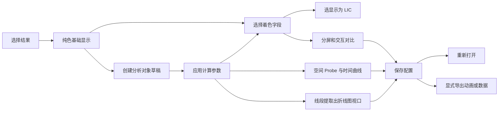
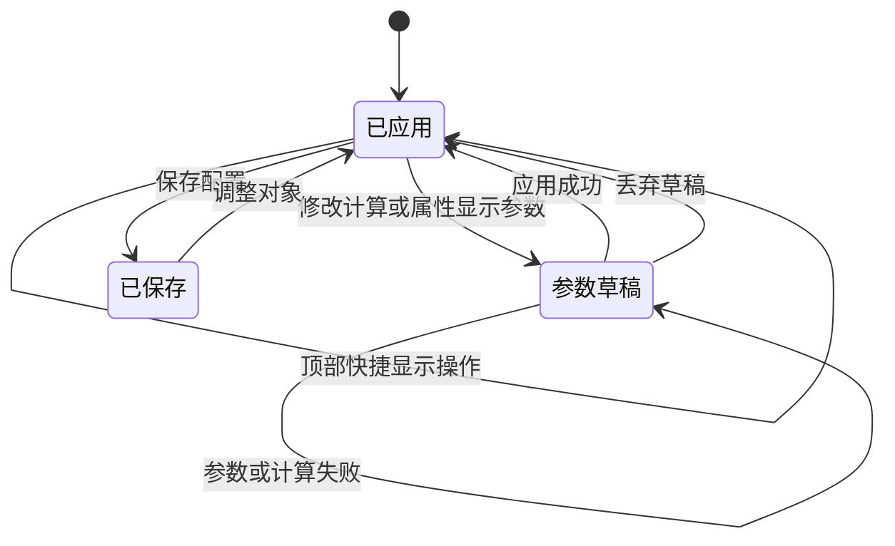

# 三维物理场工作台

## 目录

- [一、对象分析与结果展示](#一对象分析与结果展示)
  - [1.1 背景与定位](#11-背景与定位)
  - [1.2 核心业务操作流程图](#12-核心业务操作流程图)
  - [1.3 业务状态机](#13-业务状态机)
  - [1.4 状态值说明](#14-状态值说明)
  - [1.5 功能点清单](#15-功能点清单)
  - [1.6 功能点详解](#16-功能点详解)

## 一、对象分析与结果展示

### 1.1 背景与定位

面向仿真后处理，以可嵌入的独立工作台管理多个结果及分析对象。采用两行工具栏、左上资产树、左下单对象属性与中央视图。着色是显示属性，不是单独的云图创建操作；不预建压力场或温度场节点。显示模式含表面、网格、表面加网格和 Surface LIC。只有选 Surface LIC 时同一会话改用服务端出图再把画面交给前端；切回表面或网格仍走本地窗口，不改已保存的窗口类型，也不整会话重建。多个布局、自动数据对齐和时间插值不在本期范围。

### 1.2 核心业务操作流程图

### 1.3 业务状态机

### 1.4 状态值说明

- 已应用：当前可用场景；顶部快捷显示操作即时生效。
- 参数草稿：尚未提交的计算及属性显示设置；失败仍保留旧画面。
- 已保存：具有固定配置修订，可以重新打开或导出。
- 输出运行中、成功、失败、取消：由输出管理提供，独立于场景保存状态。

### 1.5 功能点清单

1. 结果与对象管理。
2. 计算和着色。
3. 固定空间 Probe。
4. 一个布局、多视图。
5. 时间播放与动画输出。
6. 配置恢复与独立嵌入。

### 1.6 功能点详解

#### 1. 结果与对象管理

导入结果自动创建纯色基础对象，支持会话内追加。切面、剖切、矢量、流线、等值面、等高线、Probe 和线段提取由用户创建；同一输入的未应用草稿只留一份；首次创建切面同时显示参数与平面手柄，重复点击不嵌套、不重复推送。分析对象可继续作为下游输入。支持搜索、显隐、重命名、复制和依赖删除；选择以独立轮廓强调当前对象，不覆盖物理量颜色。删除同时移除下游、草稿、图例和附件，不重建窗口、背景和相机；其他对象全部隐藏时保留原背景空视图。眼睛只控制当前对象在活动视图中的显示；父、子和孙对象互不传播，来源分组没有总开关。对象自身的图例、流线种子与选中平面手柄随本对象显示，计算依赖和下游显示不受影响。显隐不重建已有显示映射、不重读网格；在另一个视图首次显示时复用已计算数据建立独立显示实例。对象树每行提供删除图标，复制不复制源文件，删除不删除原数据。删除下游依赖需列出影响范围并确认，被流线当作种子的表面也计入依赖。

“导入结果”在任务产物、项目共享数据集和已挂数据根内选可视化网格，只列出网格后缀；目录必须展开并选到具体成员，非网格后缀不出现。有名称时显示名称，否则显示资产标识。追加不新建会话，也不重置原对象及相机。宿主未提供文件名时不猜测名称。工作台不猜路径，只追加宿主列出的来源。

#### 2. 计算和着色

单对象属性只显示当前对象参数。左栏采用上部对象树与下部属性表单，树略收、属性加高并自滚，标签和输入横向排列；原点、法向和空间坐标分为三个独立输入。嵌入预览贴合父框高度，不用整屏高度再叠一层。基础资产及分析对象的属性修改均需点击“应用”，可取消修改；顶部着色字段即时切换，只提交该字段，不顺带提交属性草稿。新对象在应用前仍只更新草稿。显示草稿按对象及视图隔离。切换对象保留各自草稿，迟到事件不得修改新选中对象。应用失败保留旧结果及当前草稿，取消修改释放该对象的临时附件。显隐与显示更新失败时明确提示并恢复此前状态；无法同步时提示重新连接，不能一直显示旧画面而不说明原因。透明度等样式修改保留着色数据；切换字段只处理对应显示实例。切换对象保留草稿，保存或导出前处理草稿。计算字段和着色字段分开，例如流线按速度计算、按压力着色。非法法向等参数不撤下上一次有效切片及其手柄，修正后可继续应用。字段归属与分量显式选择；范围与归一化统计独立。法向无量纲，未声明的单位不猜测。

着色范围分为自动与自定义：自动取当前对象、字段及分量的有效范围，不保存固定上下限；自定义必须提供有限、完整的上下限，最小值不大于最大值；最小等于最大画出单色映射，只有最小大于最大才拒绝。切到自定义时，先填该对象、该视图、该物理量上次应用过的自定义上下限；还没有记忆则填当前自动最小、最大。换物理量后按新场取记忆或新场自动范围。顶部换字段保留已应用的范围模式。自动范围与其他属性行同一套标签和行距；透明度单独一行并写名称。无着色时隐藏色条相关行，纯色可在属性里选一个颜色，应用后不再做色条映射。色标入口在左栏「显示设置」标题旁的图标，弹层标题带当前对象名；改显示、方向、长度、厚度、字号和位置只写该对象草稿，点弹层「应用」才写入当前选中对象的活动视图，不提交其他显示草稿。方向用两项按钮，位置是字段旁的普通下拉。右上角工具条不再放色标设置。未写过色标样式时标题字号、厚度和刻度字号默认都是 25，已保存数字原样保留。自动位置避让其他色标，自定义位置保留用户选择；保存恢复与图片输出消费同一声明。显示模式下拉含表面、网格、表面加网格和 Surface LIC；选 LIC 时属性区出现步数、步长、增强、对比、颜色混合与强度，网格上须有三维点向量作 LIC 方向，否则拒绝并说明，不切远程。能生成时先出远程静帧再打开拖转；建图或第一帧失败只提示「无法生成 Surface LIC」并回到原来的表面或网格，不停留半套远程，也不弄死可视化会话。交接未完成时拖转和滚轮不进远程交互。LIC 方向与着色物理量独立：顶部即时换场或属性应用后，颜色跟随新标量或向量幅值/分量，不再保持纯色；方向仍用已声明或回退的点向量。可选 `style.lic.vectors` 记录方向场，旧修订缺键按着色场或网格点向量读取，不回写历史文件。LIC 参数写入当前对象显示并随配置保存。

矢量图提供箭头、圆锥、线段。界面只留符号形状和「固定 / 物理量」两种大小；选物理量必须指定场，与计算矢量相同时仍按矢量模长，否则按所选场（矢量取模长、标量取绝对值）。箭头尺寸只作内部默认，圆锥和线段不再写入或校验头长、头半径、杆半径。旧三档大小和旧箭头尺寸只读兼容。节点间隔与空间均匀采样可切换；空间采样按间距分箱，选择最靠近箱中心的原节点，结果确定、无重复且不改变输入。

流线起点可选线段、球体、平面或命名面。命名面来自对象树已算出的表面，或同一授权文件中带名称的二维块和文字分区；剖切是体，不作为面。新建流线按输入包围盒填写起点、半径和积分长度；积分前把种子贴到当前网格，表面场沿切向前进。线段、球体、平面的参数写在流线属性里，未应用前可点击“预览种子”，显示形状和实际贴合后的采样点；隐藏预览必须撤下预览附件。候选附件在注记层绘制，避免不透明体网格遮挡，不参与拾取、适窗或正式导出，预览不执行流线积分；开启预览后合法参数变化同步更新，非法参数保留上次有效预览并提示。本期暂时不做视口拖种子：草稿也不挂球体三轴或线段/平面六轴手柄，`move_seed` / `plane_move` 不再绑定种子。添加流线后仍可选种子类型并应用生成。应用后正式种子仍可见但不可拖、不另建对象，不再显示预览按钮；属性提供独立的「显示种子」，关闭后只藏种子、流线仍在，不复活预览按钮。种子随对象眼睛联动，仍受「显示种子」约束。命名面只标出实际采样点。缺起点类型的旧流线仍按线段起终点计算。流线显示可选线和圆管：线用 OpenGL 线宽（部分环境上限为 1），圆管用 `vtkTubeFilter` 半径与圆周面数 3–64；写入 `style.streamline` 的 `shape` / `thickness` / `sides`，应用后生效且不重跑积分。旧修订缺键按线、细、面数 8 读取，不回写历史。

选中切面或剖切时显示灰白半透明平面及四边框，平面边长为旧版的2.5倍；三轴箭头分别平移原点，三个轴向旋转环改变法向。按下先分类：命中手柄且按住拖只改平面，不转整窗；没命中手柄或滚轮、拖空白只改本地视角，后台不必为这次手势同步相机。辅助平面只是几何，出现或变色不得夹带视角。本地三维窗的位姿由浏览器轨道持有；几何、显隐、平面颜色刷新的数据包默认不含相机，只有标准方向/适窗/分屏才允许后台改视角。LocalView 每次 `update` 都会 `after_scene_loaded`；前端只在 `render_cameras` 真正推过新位姿时同步，悬停或几何重载不得用添加平面时留下的旧位姿盖住轨道。远程出图（如 Surface LIC）手势才把相机交给后台。平面空白处不挡轨道球。悬停高亮，拖动锁定唯一目标并暂停旋转，松开、取消或失焦释放。拖动只预览并回填数字，正式切分停在上次成功应用。属性中的“显示辅助平面”独立于结果显隐，按对象及视图保存，缺省开启；隐藏对象或切换选择时撤下附件。辅助几何不进入对象树或正式导出。本地窗口左下角坐标轴跟随当前本地相机实时旋转，轨道拖动过程中就转，不只等 pointerup / EndAnimation；不以服务端 `render_cameras` 为实时源。流线与线段提取不提供线/种子拖动手柄。

切面默认打开皱折、关闭三角化，六面体结果保留被切到的完整单元面，不是默认三角面片；关闭皱折仍是平面切开，打开三角化才拆成三角。剖切只提供皱折，打开后保留被切到的整格。等值面要求体数据，等高线要求表面或切面。等值面除列表外有场范围滑条，上下限和当前值都是当前计算物理量在输入网格上的实际标量，不是归一化 0–1；换场后重算范围，当前值若已不在新场范围内则落到该场中点。手填可超过场最小最大，应用按填写值计算。读不到有效范围时滑条暂用占位 0–1 并说明，不把占位当成物理量。旧修订不写范围，打开时按当前网格现算，不回写历史 spec。等值面默认按生成标量着色，同字段保留实际等值标量并使用输入场色域，避免向量插值后重新求模长或自动放大数值噪声；其他字段着色仍允许。等高线界面只留自动分层，10个等值级别，允许1–256，可调线宽且不重算等值；常量场明确提示。旧自定义等值列表仍能打开显示，不能同时声明两种方式。域内空结果明确提示，错误参数保留上一次成功结果。线段提取对齐 ParaView [Plot Over Line](https://www.paraview.org/paraview-docs/latest/python/paraview.simple.__init__.PlotOverLine.html) 与 [Line Chart View](https://docs.paraview.org/en/latest/UsersGuide/displayingData.html#line-chart-view)：它是对象树里的独立对象，参数为起点、终点和均匀取样分辨率（2–20000），本期不提供视口拖线或手柄，也不再提供取样物理量选择。应用后沿线取全部场；图上画哪些只由 Y 轴决定。旧修订已写 `parameters.fields` 只读兼容，不回写；再应用改为全部场。应用后三维 Render View 可画一条静态示意线；同时按 ParaView 习惯打开或激活一个 Line Chart View，折线画在视口区而不是只在侧栏。折线图窗活跃时，左侧树只列出线段提取，来源行仅在其下仍有线段提取时保留；眼睛只改该折线图，不能把切面等三维对象当作该窗内容。切回三维窗恢复全树。计算（两端、分辨率）须应用后重算；X/Y 轴是显示属性，当前视口为折线图时立即重画。X 轴对应官方 `X Array Name` / `Use Index for XAxis`：缺省 `arc_length`，可选采样点序号、`Points_X` / `Points_Y` / `Points_Z` 及已取样场。Y 轴对应 `Series Parameters`，可多选物理量画多条曲线；对象或视口缺轴时 X=弧长、Y=已取样第一条标量，不回写历史 spec。CSV 导出当前图的 X + 所选 Y，可下载读回。沿线取值走本包探针，不引入研究计算包。

#### 3. 固定空间 Probe

新建时在输入包围盒中心显示候选球。「点选拾取」是 Probe 属性里的可见模式开关，不是又一个分析工具；该行只有行名加一个开关，不再并排按钮或说明句。开着时在模型上点到有效位置立刻出球，未点中模型时保留上一次候选球；应用后按属性里勾选的物理量出表。关着时点击模型走轨道或其他工具，不误出球。切到切面/流线/旋转等其他操作会关掉点选，开关跟后台是否接受拾取一致。旧修订缺 `pick_enabled` 视为关，不回写历史 spec。候选球在注记层绘制，不能被模型遮挡或拾取，草稿提示“位置未应用”；应用后 Probe 标签变为所选量的数值表，提取侧栏同步同一张表，不必先点「当前数值」。取消或切换对象释放临时标记。

通过表面点击或 XYZ 坐标指定位置，保存输入、位置、所选字段和标签显隐。探针标记与标签的显示设置独立于输入对象，修改显隐不重新采样。查询同一空间位置的当前值及时间曲线；同名点场、单元场区分展示。重新打开 Probe 后，标签可选字段和网格信息继续来自输入对象。域外或缺帧显示无效，不以零填充。数值标签与标记跟随视图显示，标签按屏幕像素设定初始字号，在小视口内缩放定位并通过引线连接固定锚点；标签、方向轴与时间进入截图和动画。CSV 单分量字段输出数值单元格，缺失位置保持空值及无效标记，历史导出不改写。CSV 仅在明确导出时生成，“导出 CSV”直接预选 CSV 格式；通用图片/数据菜单仍默认图片。

#### 4. 一个布局、多视图

“视图设置”提供当前视图背景颜色与恢复默认，空场景仍可操作；删除最后一个可见对象保留背景和相机。支持一至四个窗口。新增标签即新增窗口：先全幅，再横排两个，第三个出现在下方通栏，第四个形成田字格。新增窗口时须选择类型，中文选项为「三维渲染」（Render View）或「折线图」（Line Chart View），对齐 ParaView 分割后点选视图类型；加号与分割菜单贴在对应按钮旁边展开，不飞到工作台左侧。旧修订缺 `type` 按三维渲染读取，不回写历史文件。折线图视口不绘制三维场景，叠加独立折线标记与 CSV 导出。每个窗体左上角是对应标签，窗体边框为白色底上的明确描边。点某个窗体、标签或三维画面即成活跃窗；左侧仍是同一批对象，眼睛只反映并改这一窗的显隐，不重读网格。各窗口共享处理对象，独立保存显隐、着色与图例；折线图另存 `chart.source` / `x_array` / `y_arrays`。关闭窗口不删除对象。相机联动默认关闭，开启后全体窗口共用相机，不要求共同坐标空间；已声明单位不一致只提示，不挡住联动。方向轴、标准方向与适窗属于当前窗口。蓝色线性图标工具带提供直接操作；七个原分析图标约缩小四分之一，第八项是线段提取，同一套尺寸，中文标签仍可读。窄窗口把分析和标准方向收纳到菜单，菜单挂到页面根节点以免被工作台裁切，操作不因裁切而丢失。宿主嵌入时关闭后的对话框蒙层不得挡住三维窗口点击。普通鼠标移动不请求计算或场景刷新；只有命中平面手柄后的拖动才更新草稿，松开保留最终坐标，坐标输入在该次拖动提交结束后开放，防止晚到的回填覆盖新输入；仍须应用后才切开。鼠标轨道结束只回写活动相机，不重建对象树、不重读网格；容器尺寸变化只重定位注记。恢复视角与分屏后按可见结果调整近远裁剪范围，避免远距离相机截断结果；联动覆盖全部窗口的共同可见范围。

#### 5. 时间播放与动画输出

使用实际时间步，支持正反播放、逐帧、暂停及停止回首帧。多个结果精确匹配时间，缺帧明确提示。同拓扑可复用几何，字段始终使用当前帧。顶部动画入口默认逐帧生成 MP4，选择范围、方向、步长和输出视图；默认 1280×720、24 fps，不插值物理时间。实际操作 WebM 录制在导出菜单中。导出必须绑定已保存修订，支持进度、取消和成功下载。PNG 及 PNG 序列可选择透明背景，生成真实透明通道并保留模型和色标；MP4 不提供透明输出。输出不改变工作台背景，临时手柄、选择框与候选预览不进入图片。

#### 6. 配置恢复与独立嵌入

保存来源引用、对象参数和显示布局，不保存网格副本或自动截图。旧配置读取时兼容转换，历史修订与摘要保持原样，再次保存产生新修订。独立工作台与宿主共用功能，嵌入时移除外围留白与重复工具栏；导出状态作为可关闭提示显示，不挤占工作区；宿主选择项目任务及授权来源，共享表单处理资产保存和输出。保存不创建研究任务版本。视图默认光照对齐 ParaView Light Kit（主光、补光、两盏轮廓光、头灯），旧修订缺灯组或阴影键时按该默认装配，不回写历史 spec；对象上的「光照」开关只控制该对象是否接收光照，不改色标映射。阴影开关默认关闭，只在受支持的 Linux 远程环境开放，其验收与本机普通光照分开记录。

后处理宿主在Tab间切换只改变可见性，不销毁工作区。隐藏暂停当前播放但保持连接与心跳，返回更新视口尺寸；对象和各自未应用草稿保持。IPC追加来源前保存当前草稿，多个来源加载失败保留旧场景。来源追加按固定引用去重，离开宿主页才关闭；刷新后仍需显式保存的配置恢复。启动缺少工作台依赖时提示缺失项与当前环境安装方式；与已连接后发生的操作错误分开反馈。显式重开或宿主重建时先关闭旧会话再创建，避免占满并发后iframe没有会话地址。满员时回收已无心跳的短空闲会话；活动页面的续约不受影响。

物理场嵌入页面按父 iframe 高度布局：拉高 Ant Design App 包装层，不用 100dvh 再叠一层浏览器视口，并覆盖 Vuetify 默认 100vh，避免主体被压成只剩工具条。后处理宿主给三维页剩余视口高度；宿主切换Tab保持文档；显式重开新会话替换文档。验收同时检查内外iframe高度比例、真实工具栏和完整视口，不以存在canvas代替布局验收。
